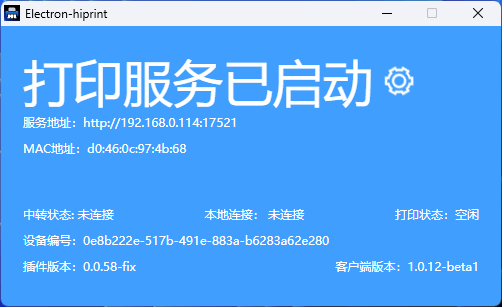
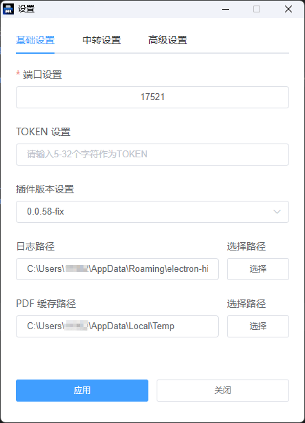
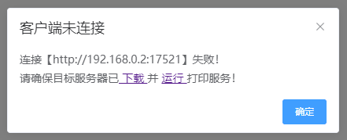

# electron-hiprint

这个项目是为 [vue-plugin-hiprint](https://github.com/CcSimple/vue-plugin-hiprint) 配套开发的不弹框静默打印方案，我们发现部分使用此项目的开发者有自己的设计器或渲染方案，也可能仅仅是需要将一段 HTML、一个 PDF 静默打印出来。如果你也是这样的需求，那么这个项目将能解决你的问题。

## 预览 <a href="https://ccsimple.gitee.io/vue-plugin-hiprint/">vue-plugin-hiprint</a> 打印设计 demo

<div align="center">



</div>

## 调试/打包

```shell
git clone https://github.com/CcSimple/electron-hiprint.git
# or
git clone https://gitee.com/CcSimple/electron-hiprint.git

# init
cd electron-hiprint
npm install

# 调试预览
# win
npm run start
# mac
npm run startmac

# 打包 win x64，其余平台版本详情见 package.json
npm run build-w-64
```

## Web 打印设计渲染插件

[vue-plugin-hiprint](https://github.com/CcSimple/vue-plugin-hiprint.git)

## 打印原理说明

1. WEB 连接客户端开启的 socket.io 服务 (默认端口 17521)

   - socket.io-client^4.x 连接 ("http://localhost:17521")

2. 通过 socket.io-client^4.x 服务发送打印数据 (news)

   - socket.emit("news", { html, templateId, printer, pageSize });
   - 主要参数 html: 即 html 字符串，templateId: 用于回调 successs / error 时的标识
   - printer: 打印机名称，pageSize: 打印纸张大小 (其他参数,见下面的示例)

## 打印端设置

### v1.0.7 后续版本添加的设置功能

可安装后于安装目录找到 config.json 修改配置，亦或者修改项目文件中默认值后重新打包发行自己的版本及设置。

也可以右键托盘，选择 `设置` 后在 `设置` 窗口中进行设置。

<div align="center">



</div>

```js
{
    "openAtLogin": true,                        // 登录时打开应用程序
    "openAsHidden": true,                       // 以隐藏方式打开应用程序
    "connectTransit": true,                     // 连接中转服务
    "port": "17521",                            // 端口号
    "token": null,                              // 身份验证 token
    "transitUrl": "https://printjs.cn:17521",   // 中转服务地址
    "transitToken": "vue-plugin-hiprint",       // 中转服务 token
    "closeType": "tray"                         // 主窗口关闭类型
}
```

1. `openAtLogin` Boolean 系统登录时自启动应用
2. `openAsHidden` Boolean 自启动时以隐藏方式打开应用
3. `connectTransit` Boolean 连接中转服务
4. `prot` String | Number ( 10000 - 65535 ) 端口号默认为 `17521`
5. `token` String( * | null ) 身份校验，只支持固定 token，需要登录等验证请自行二开实现
    - [vue-plugin-hiprint](https://github.com/CcSimple/vue-plugin-hiprint.git) 需要使用 [0.0.55](https://www.npmjs.com/package/vue-plugin-hiprint?activeTab=versions) 之后的版本
6. `transitUrl` 中转服务地址
7. `transitToken` 中转服务 token
8. `closeType` String( `tray` | `quit` ) 关闭主窗口后
    - 最小化到托盘 `tray`
    - 退出程序 `quit`

## 中转服务 [node-hiprint-transit](https://github.com/Xavier9896/node-hiprint-transit)

使用此客户端打印一直存在 http 跨域、web 只能连接本机客户端等问题，所以诞生了 `node-hiprint-transit` 这个中转代理服务。在 `V1.0.7` 版本中，添加了连接中转服务代理的设置，通过这些配置，将会在 `客户端` 与 `node-hiprint-transit` 间建立通信，在你的项目中，只需连接中转服务就能获取到所有连接中转服务的 `客户端` 信息，并且可以选择任意客户端的任意打印机进行打印。

如果你有云打印的需求，可以考虑使用此项目，将服务部署在服务器上，即可实现一个基础的云打印功能。

> 如果你的项目是一个 SaaS 类型的项目，你需要自行二开以实现不同租户之间的隔离。

# 非 `vue-plugin-hiprint` 插件连接使用本客户端说明

我们发现部分使用此项目的开发者并未使用 `vue-plugin-hiprint` 插件，他们有自己的设计器或渲染方案，所以特此将本项目的使用说明进行了补充，方便广大开发者使用。

## 连接客户端

1. 在你自己的项目中引入 socket.io-client^4.x 依赖

    ```console
    npm i socket.io-client --save
    ```

2. 连接客户端

    ```js
    import { io } from "socket.io-client";

    const socket = io("http://localhost:17521", {
      transports: ["websocket"],
      auth: {
        token: "vue-plugin-hiprint", // 在此处填入你 client 设置的 token，缺省可留空
      }
    })
    ```

## 获取客户端信息

```js
socket.on("connect", () => {
  globalThis.connect = true;
  // TODO: Do something for your project
})
```

### 连接为 `electron-hiprint`

连接成功后 `electron-hiprint` 会主动发送 `clientInfo`、`printerList` 事件，你只需要监听这两个事件即可获取到客户端信息与打印机列表。

```js
socket.on("clientInfo", (clientInfo) => {
  globalThis.clientInfo = clientInfo;
});

socket.on("printerList", (printerList) => {
  globalThis.printerList = printerList;
})
```

```js
// clientInfo
{
  arch: "x64",
  clientUrl: "http://192.168.0.2:17521",
  ip: "192.168.0.2",
  ipv6: "fe80::13f:eb0f:e426:7c92",
  mac: "a1:a2:a3:a4:a5:a6",
  machineId: "12c90ff9-b9f4-4178-9099-9dd326b70c2e",
  platform: "win32",
  version: "1.0.7",
}

// printerList
[{
  description: "",
  displayName: "Microsoft Print to PDF",
  isDefault: true,
  name: "Microsoft Print to PDF",
  options: {,
    "printer-location": "",
    "printer-make-and-model": "Microsoft Print To PDF",
    "system_driverinfo": "Microsoft Print To PDF;10.0.19041.3570 (WinBuild.160101.0800);Microsoft® Windows® Operating System;10.0.19041.3570"
  },
  status: 0
}, {…}, {…}, {…}, {…}, {…}]
```

你也可以主动向 `electron-hiprint` 发送 `getClientInfo`、`refreshPrinterList` 事件，来获取客户端打印机列表。

```js
socket.emit("getClientInfo");
socket.emit("refreshPrinterList");
```

### 连接为 `node-hiprint-transit`

连接成功后 `node-hiprint-transit` 会主动发送 `clients`、`printerList` 事件，你只需要监听这两个事件即可获取到客户端信息与打印机列表。

```js
socket.on("clients", (clients) => {
  globalThis.clients = clients;
});

socket.on("printerList", (printerList) => {
  globalThis.printerList = printerList;
})
```

```js
// clients
{
  "AlBaUCNs3AIMFPLZAAAh": {
    arch: "x64",
    clientUrl: "http://192.168.0.2:17521",
    ip: "192.168.0.2",
    ipv6: "fe80::13f:eb0f:e426:7c92",
    mac: "a1:a2:a3:a4:a5:a6",
    machineId: "12c90ff9-b9f4-4178-9099-9dd326b70c2e",
    platform: "win32",
    printerList: [{
      description: "",
      displayName: "Microsoft Print to PDF",
      isDefault: true,
      name: "Microsoft Print to PDF",
      options: {,
        "printer-location": "",
        "printer-make-and-model": "Microsoft Print To PDF",
        "system_driverinfo": "Microsoft Print To PDF;10.0.19041.3570 (WinBuild.160101.0800);Microsoft® Windows® Operating System;10.0.19041.3570"
      },
      status: 0
    }, {…}, {…}, {…}, {…}, {…}],
    version: "1.0.7",
  },
  "clientid": {…},
  ...
}

// printerList
[{
  clientId: "AlBaUCNs3AIMFPLZAAAh",
  description: "",
  displayName: "Microsoft Print to PDF",
  isDefault: true,
  name: "Microsoft Print to PDF",
  options: {,
    "printer-location": "",
    "printer-make-and-model": "Microsoft Print To PDF",
    "system_driverinfo": "Microsoft Print To PDF;10.0.19041.3570 (WinBuild.160101.0800);Microsoft® Windows® Operating System;10.0.19041.3570"
  },
  status: 0
}, {…}, {…}, {…}, {…}, {…}]
```

你也可以主动向 `electron-hiprint` 发送 `getClients`、`refreshPrinterList` 事件，来获取客户端打印机列表。

```js
socket.emit("getClients");

socket.emit("refreshPrinterList");
// node-hiprint-transit 会将这个请求再转发给所有连接的 electron-hiprint ，以获取最新的打印机列表，但是并没有等待所有 electron-hiprint 响应结束，而是在延迟 2s 后直接返回了缓存及新获取到的打印机列表。并且 node-hiprint-transit 每 10min 都会主动向 electron-hiprint 请求一次 printerList，所以这应该并无大碍。或者你也可以优化这一个功能。

// https://github.com/Xavier9896/node-hiprint-transit/blob/main/index.js#L139
```

## 获取打印机纸张信息

### 连接为 `electron-hiprint`

依赖 [win32-pdf-printer](https://www.npmjs.com/package/win32-pdf-printer) 包实现，暂时只支持 window 环境中使用！

> ❗️ node-hiprint-transit 中转暂未添加支持

```js
// printerName: 打印机名称 可选值，缺省时返回所有打印机的纸张信息
if (globalThis.connect) {
  socket.emit("getPaperSizeInfo", printerName);
} else {
  alert("未连接客户端！")
  window.open("hiprint://")
}
```

```js
[
    {
        "PrinterName": "Microsoft Print to PDF",
        "TaskNumber": 0, // 打印队列任务数
        "Status": 0, // 打印机状态码
        "StatusMsg": "准备就绪（Ready）", // 打印机状态信息
        "PaperSizes": [
            {
                "Height": 1100,
                "Kind": 1,
                "PaperName": "信纸",
                "RawKind": 1,
                "Width": 850
            },
            {...}, {...}, {...}
        ]
    }
]
```
## 打印 HTML

### 连接为 `electron-hiprint`

```js
/**
 * @description: 打印 html 字符串
 * @param {String} html 打印的html字符串
 * @param {String|number} templateId vue-plugin-hiprint 中的模板id，你可以自定义传入一个 Id，用于回调 success/error 判断
 * @param {String} printer 打印机名称 printer.name 可为空，缺省默认使用设备默认打印机
 * @param {pageSize} pageSize 打印纸张大小 { height: 80 * 1000, width: 60 * 1000 } 可为空，缺省默认使用打印机默认纸张
 * @description: 其他参数参考 默认打印参数说明
 */
if (globalThis.connect) {
  socket.emit("news", { html, templateId, printer, pageSize });
} else {
  alert("未连接客户端！")
  window.open("hiprint://")
}
```

### 连接为 `node-hiprint-transit`

当你连接中转服务时，需要在参数中指定 `client`

```js
// 你可以自行在项目中实现一个选择客户端、打印机的功能
const clientId = "AlBaUCNs3AIMFPLZAAAh"
const client = globalThis.clients[clientId]
const printer = globalThis.clients[0].printerList[0]

if (globalThis.connect) {
  socket.emit("news", { html, client: clientId, templateId, printer, pageSize })
  socket.emit("news", { html, client: client.clientId, templateId, printer: printer.name, pageSize })
} else {
  alert("未连接客户端！")
  window.open("hiprint://")
}
```

### 默认打印参数说明

```js
// 详见electron文档: https://www.electronjs.org/zh/docs/latest/api/web-contents
{
    silent: data.silent ?? true, // 静默打印
    printBackground: data.printBackground ?? true, // 是否打印背景
    deviceName: deviceName, // 打印机名称
    color: data.color ?? true, // 是否打印颜色
    margins: data.margins ?? {
      marginType: "none",
    }, // 边距
    landscape: data.landscape ?? false, // 是否横向打印
    scaleFactor: data.scaleFactor ?? 100, // 打印缩放比例
    pagesPerSheet: data.pagesPerSheet ?? 1, // 每张纸的页数
    collate: data.collate ?? true, // 是否排序
    copies: data.copies ?? 1, // 打印份数
    pageRanges: data.pageRanges ?? {}, // 打印页数
    duplexMode: data.duplexMode, // 打印模式 simplex,shortEdge,longEdge
    dpi: data.dpi, // 打印机DPI
    header: data.header, // 打印头
    footer: data.footer, // 打印尾
    pageSize: data.pageSize, // 打印纸张 // A0, A1, A2, A3, A4, A5, A6, Legal, Letter, Tabloid
}
// 其中纸张大小参数 pageSize 如果传自定义大小, 需要乘以 1000
{ height: 80 * 1000, width: 60 * 1000 }
```

## 使用 pdf 打印功能

原理:

1. 通过 electron 的 printToPDF 先导出 pdf 文件
2. 再通过 pdf-to-printer 或 unix-print 打印 pdf 文件

> 传数据时需要传入: { type:'pdf' }

> 如果是自定义的纸张大小, 别忘了 传 自定义的 pageSize

eg: {height: 80 * 1000, width: 60 * 1000}

```js
{
    client?: string; // 客户端id，连接中转服务必填
    printer?: string; // 打印机名称
    pages?: string; // 打印页数
    subset?: string; // 奇偶页 even、odd
    orientation?: string; // 纸张方向 portrait、landscape
    scale?: string; // 缩放 noscale、shrink、fit
    monochrome?: boolean; // 黑白打印 true、false
    side?: string; // 单双面 duplex, duplexshort, duplexlong, and simplex
    bin?: string; // select tray to print to
    paperName?: string; // 纸张大小 A2, A3, A4, A5, A6, letter, legal, tabloid, statement
    silent?: boolean; // Silences error messages.
    printDialog?: boolean; // 显示打印对话框 true、false
    copies?: number; // 打印份数
}

// vue-plugin-hiprint
hiprint.hiwebSocket.send({ html, client, printer, type: 'pdf'})

// 非vue-plugin-hiprint
socket.emit("news", { html, client, printer, type: 'pdf'})
```
## 下载网络 pdf 打印

原理：

1.通过node的http或https库下载网络pdf文件至用户临时目录
2.后续内容同使用pdf打印功能

> 因为打印网络pdf不存在模板拼接，所以打印时直接如下调用即可

```js
// vue-plugin-hiprint
hiprint.hiwebSocket.send({ client, printer, type: 'url_pdf', pdf_path: '网络PDF的下载url' })

// 非vue-plugin-hiprint
socket.emit("news", { client, printer, type: 'url_pdf', pdf_path: '网络PDF的下载url' })
```

## 打印回调

```js
socket.on("success", (res) => {
  console.log(res.templateId)
  // TODO: Do something for your project
})

socket.on("error", (res) => {
  console.log(res.templateId)
  // TODO: Do something for your project
})
```

## 断开连接

```js
socket.on("disconnect", () => {
  globalThis.connect = false;
  // TODO: Do something for your project
})
```

## URLScheme `hiprint://`

通过 URLScheme 可以方便的让我们在 Web 项目中调起当前设备中安装的 `electron-hiprint` 客户端，以便未建立连接时主动唤起客户端。

> 安装客户端时请 `以管理员身份运行` ，才能成功添加 URLScheme

使用：浏览器地址栏输入 `hiprint://` 并回车

<div align="center">




</div>

```js
// js
window.open("hiprint://")

// element-ui
this.$alert(`连接【${hiwebSocket.host}】失败！<br>请确保目标服务器已<a href="https://gitee.com/CcSimple/electron-hiprint/releases" target="_blank"> 下载 </a> 并 <a href="hiprint://" target="_blank"> 运行 </a> 打印服务！`, "客户端未连接", {dangerouslyUseHtmlString: true})

// ant-design v1
this.$error({
  title: "客户端未连接",
  content: (h) => (
    <div>
      连接【{hiwebSocket.host}】失败！
      <br />
      请确保目标服务器已
      <a
        href="https://gitee.com/CcSimple/electron-hiprint/releases"
        target="_blank"
      >
        下载
      </a>
      并
      <a href="hiprint://" target="_blank">
        运行
      </a>
      打印服务！
    </div>
  ),
});
```

## 学习借鉴

- electron <a href="https://www.electronjs.org/zh/docs/latest/">https://www.electronjs.org/zh/docs/latest/</a>
- electron-egg <a href="https://gitee.com/wallace5303/electron-egg/">https://gitee.com/wallace5303/electron-egg/</a>
- pdf-to-printer <a href="https://github.com/artiebits/pdf-to-printer">https://github.com/artiebits/pdf-to-printer</a>
- unix-printer <a href="https://github.com/artiebits/unix-print">https://github.com/artiebits/unix-print</a>
