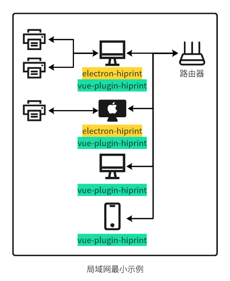
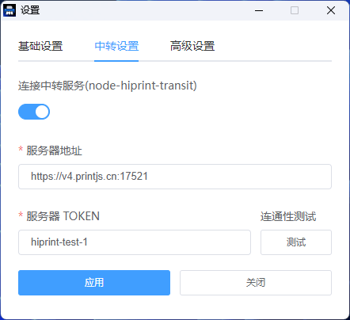
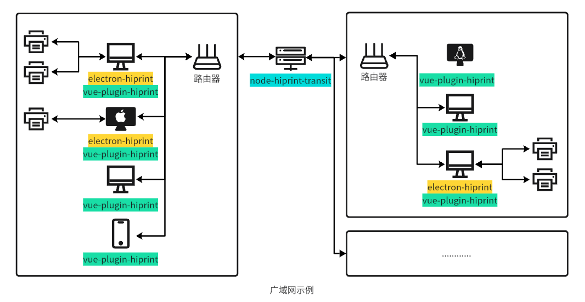
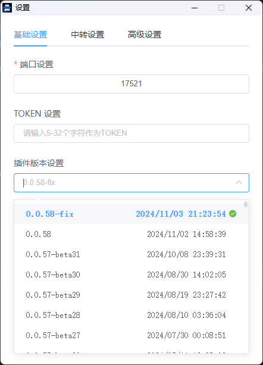
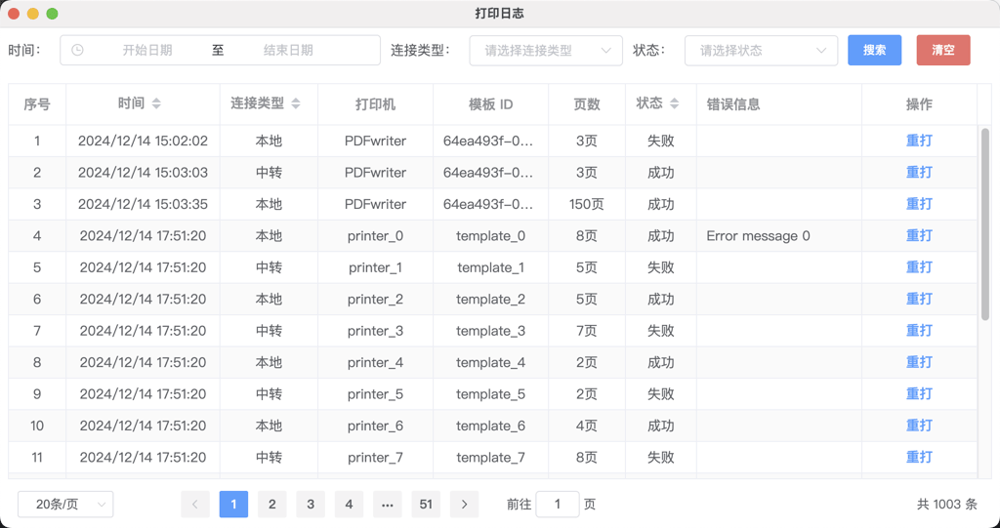

# electron-hiprint

[](https://deepwiki.com/CcSimple/electron-hiprint)

<div align="center">


</div>

该项目是为 [vue-plugin-hiprint](https://github.com/CcSimple/vue-plugin-hiprint) 配套开发的静默打印解决方案。我们发现部分使用此项目的开发者拥有自定义的设计器或渲染方案，或者仅需要静默打印一段 HTML、PDF。如果您也有类似需求，electron-hiprint 将是您的理想选择。

<div align="center">


</div>

## 快速开始

#### 下载发行版

1. [github releases](https://github.com/CcSimple/electron-hiprint/releases)
2. [gitee releases](https://gitee.com/CcSimple/electron-hiprint/releases)

#### 本地调试与打包

```shell
git clone https://github.com/CcSimple/electron-hiprint.git
# or
git clone https://gitee.com/CcSimple/electron-hiprint.git

# init
cd electron-hiprint
npm install

# 调试预览
npm run start

# 打包 win x64，其余平台版本详情见 package.json
npm run build-w-64
```

## 推荐的 Web 打印设计渲染插件

[vue-plugin-hiprint](https://github.com/CcSimple/vue-plugin-hiprint.git)

## 打印原理

1. **客户端服务**：通过 socket.io (默认端口 17521)提供服务。

   - 使用 `socket.io-client@4.x` 连接: `http://localhost:17521`

2. **发送打印数据**：通过 `socket.emit` 方法发送打印数据

   - 示例:
      ```js
      socket.emit("news", { html, templateId, printer, pageSize })
      ```

   - 参数说明：
      - `html`: HTML 字符串。
      - `templateId`: 用于标识成功或失败回调的 ID。
      - `printer`: 打印机名称。
      - `pageSize`: 打印纸张大小。

## 拓扑结构

<div align="center">



</div>

## 客户端设置

在 `v1.0.7` 后续版本中，支持这些设置

<div align="center">


</div>

```json
{
  "mainTitle": "Electron-hiprint",
  "nickName": "",
  "openAtLogin": true,
  "openAsHidden": true,
  "port": "17521",
  "token": null,
  "connectTransit": true,
  "transitUrl": "https://v4.printjs.cn:17521",
  "transitToken": "hiprint-youcode",
  "allowNotify": true,
  "closeType": "tray",
  "pluginVersion": "0.0.58-fix",
  "logPath": "C:\\Users\\Administrator\\AppData\\Roaming\\hiprint\\logs",
  "pdfPath": "C:\\Users\\Administrator\\AppData\\Local\\Temp",
  "defaultPrinter": "",
  "disabledGpu": false,
  "rePrint": true
}
```

### 配置项说明
1. `mainTitle` (String): 主标题（隐式设置）
2. `nickName` (String): 可设置的便于识别的友好设备名称
3. `openAtLogin` (Boolean): 系统登录时启动
4. `openAsHidden` (Boolean): 启动时隐藏窗口
5. `connectTransit` (Boolean): 连接中转服务
6. `port` (String | Number) ( 10000 - 65535 ) 端口号默认为 `17521`
7. `token` String( * | null ) 身份验证令牌，支持固定 Token
    - [vue-plugin-hiprint](https://github.com/CcSimple/vue-plugin-hiprint.git) 需要使用 [0.0.55](https://www.npmjs.com/package/vue-plugin-hiprint?activeTab=versions) 之后的版本
8. `transitUrl` (String): 中转服务地址
9. `transitToken` (String): 中转服务令牌
10. `closeType` (String): 窗口关闭行为 (tray 或 quit)
    - 最小化到托盘 `tray`
    - 退出程序 `quit`
11. `pluginVersion` (String): vue-plugin-hiprint 插件版本
12. `logPath` (String): 日志路径
13. `pdfPath` (String): 临时文件路径
14. `defaultPrinter` (String): 默认打印机
15. `disabledGpu` (Boolean): 禁用 GPU 加速，可解决部分设备打印模糊问题，默认 `false`
16. `rePrint` (Boolean): 是否允许重打默认 `true` （隐式设置）

### 覆盖默认配置方法

1. 二开项目，直接修改 [项目源码](./tools/utils.js) 并重新打包
2. win `v1.0.12-beta6` 后续版本可在 `exe` 安装包路径添加 `config.json`,安装包会自动检测并使用该配置

    ```
    hiprint_win_x64-1.0.12-beta7.exe
    config.json
    ```

## 中转服务

项目支持 [node-hiprint-transit](https://github.com/Xavier9896/node-hiprint-transit)，可解决跨域问题并实现云打印功能

<div align="center">



</div>

<div align="center">



</div>

# 与非 `vue-plugin-hiprint` 项目的兼容

目标用户：只需要实现 HTML、PDF 静默打印，未使用 `vue-plugin-hiprint` 设计插件。

## 客户端连接
1. 安装依赖

    ```console
    npm install socket.io-client@4 --save
    ```

2. 连接示例

    ```js
    import { io } from "socket.io-client";

    const socket = io("http://localhost:17521", {
      transports: ["websocket"],
      auth: {
        token: "vue-plugin-hiprint",
      }
    })

    socket.on("connect", () => {
      globalThis.connect = true;
      // TODO: Do something for your project
    })
    ```
3. 获取客户端信息

    <details>
      <summary>
        与 <b>electron-hiprint</b> 建立连接
      </summary>

      - 连接成功后 `electron-hiprint` 会主动发送 `clientInfo`、`printerList` 事件，你只需要监听这两个事件即可获取到客户端信息与打印机列表。

      ```js
      socket.on("clientInfo", (clientInfo) => {
        globalThis.clientInfo = clientInfo;
      });

      socket.on("printerList", (printerList) => {
        globalThis.printerList = printerList;
      })
      ```

      ```js
      // clientInfo
      {
        "hostname": "Admin", // 主机名
        "version": "1.0.12-beta9", // 客户端版本
        "platform": "win32", // 平台类型
        "arch": "x64", // 系统架构
        "mac": "d0:46:0c:97:4b:68", // mac 地址
        "ip": "192.168.0.114", // 设备 ip
        "ipv6": "fe80::2157:4b26:1c2f:c4ca", // 设备 ipv6
        "clientUrl": "http://192.168.0.114:17521", // 本地服务地址
        "machineId": "0e8b222e-517b-491e-883a-b6283a62e280", // 设备唯一 ID
        "nickName": "打印客户端", // 友好昵称
      }

      // printerList
      [{
        description: "",
        displayName: "Microsoft Print to PDF",
        isDefault: true,
        name: "Microsoft Print to PDF",
        options: {,
          "printer-location": "",
          "printer-make-and-model": "Microsoft Print To PDF",
          "system_driverinfo": "Microsoft Print To PDF;10.0.19041.3570 (WinBuild.160101.0800);Microsoft® Windows® Operating System;10.0.19041.3570"
        },
        status: 0
      }, {…}, {…}, {…}, {…}, {…}]
      ```

      你也可以主动向 `electron-hiprint` 发送 `getClientInfo`、`refreshPrinterList` 事件，来获取客户端打印机列表。

      ```js
      socket.emit("getClientInfo");
      socket.emit("refreshPrinterList");
      ```
    </details>

    <details>
      <summary>
        与 <b>node-hiprint-transit</b> 建立连接
      </summary>

      - 连接成功后 `node-hiprint-transit` 会主动发送 `clients`、`printerList` 事件，你只需要监听这两个事件即可获取到客户端信息与打印机列表。

      ```js
      socket.on("clients", (clients) => {
        globalThis.clients = clients;
      });

      socket.on("printerList", (printerList) => {
        globalThis.printerList = printerList;
      })
      ```

      ```js
      // clients
      {
        "AlBaUCNs3AIMFPLZAAAh": {
          "hostname": "Admin", // 主机名
          "version": "1.0.12-beta9", // 客户端版本
          "platform": "win32", // 平台类型
          "arch": "x64", // 系统架构
          "mac": "d0:46:0c:97:4b:68", // mac 地址
          "ip": "192.168.0.114", // 设备 ip
          "ipv6": "fe80::2157:4b26:1c2f:c4ca", // 设备 ipv6
          "clientUrl": "http://192.168.0.114:17521", // 本地服务地址
          "machineId": "0e8b222e-517b-491e-883a-b6283a62e280", // 设备唯一 ID
          "nickName": "打印客户端", // 友好昵称
          printerList: [{
            description: "",
            displayName: "Microsoft Print to PDF",
            isDefault: true,
            name: "Microsoft Print to PDF",
            options: {,
              "printer-location": "",
              "printer-make-and-model": "Microsoft Print To PDF",
              "system_driverinfo": "Microsoft Print To PDF;10.0.19041.3570 (WinBuild.160101.0800);Microsoft® Windows® Operating System;10.0.19041.3570"
            },
            status: 0
          }, {…}, {…}, {…}, {…}, {…}],
          version: "1.0.7",
        },
        "clientid": {…},
        ...
      }

      // printerList
      [{
        clientId: "AlBaUCNs3AIMFPLZAAAh",
        description: "",
        displayName: "Microsoft Print to PDF",
        isDefault: true,
        name: "Microsoft Print to PDF",
        options: {,
          "printer-location": "",
          "printer-make-and-model": "Microsoft Print To PDF",
          "system_driverinfo": "Microsoft Print To PDF;10.0.19041.3570 (WinBuild.160101.0800);Microsoft® Windows® Operating System;10.0.19041.3570"
        },
        status: 0
      }, {…}, {…}, {…}, {…}, {…}]
      ```

      你也可以主动向 `node-hiprint-transit` 发送 `getClients`、`refreshPrinterList` 事件，来获取客户端打印机列表。

      ```js
      socket.emit("getClients");

      socket.emit("refreshPrinterList");
      // node-hiprint-transit 会将这个请求再转发给所有连接的 electron-hiprint ，以获取最新的打印机列表，但是并没有等待所有 electron-hiprint 响应结束，而是在延迟 2s 后直接返回了缓存及新获取到的打印机列表。并且 node-hiprint-transit 每 10min 都会主动向 electron-hiprint 请求一次 printerList，所以这应该并无大碍。或者你也可以优化这一个功能。

      // https://github.com/Xavier9896/node-hiprint-transit/blob/main/index.js#L139
      ```
    </details>


## 获取打印机纸张信息

> [!IMPORTANT]
> 该功能暂时只在 Window 环境下安装的 `electron-hiprint` 中支持，`node-hiprint-transit` 中转暂时也未支持！

<details>
  <summary>
    连接为 <b>electron-hiprint</b>
  </summary>

  ```js
  // printerName: 打印机名称 可选值，缺省时返回所有打印机的纸张信息
  if (globalThis.connect) {
    socket.emit("getPaperSizeInfo", printerName);
  } else {
    alert("未连接客户端！")
    window.open("hiprint://")
  }
  ```

  ```js
  [
      {
          "PrinterName": "Microsoft Print to PDF",
          "TaskNumber": 0, // 打印队列任务数
          "Status": 0, // 打印机状态码
          "StatusMsg": "准备就绪（Ready）", // 打印机状态信息
          "PaperSizes": [
              {
                  "Height": 1100,
                  "Kind": 1,
                  "PaperName": "信纸",
                  "RawKind": 1,
                  "Width": 850
              },
              {...}, {...}, {...}
          ]
      }
  ]
  ```
</details>

## 打印 HTML

<details>
  <summary>
    连接为 <b>electron-hiprint</b>
  </summary>

  ```js
  /**
   * @description: 打印 html 字符串
   * @param {String} html 打印的html字符串
   * @param {String|number} templateId vue-plugin-hiprint 中的模板id，你可以自定义传入一个 Id，用于回调 success/error 判断
   * @param {String} printer 打印机名称 printer.name 可为空，缺省默认使用设备默认打印机
   * @param {pageSize} pageSize 打印纸张大小 { height: 80 * 1000, width: 60 * 1000 } 可为空，缺省默认使用打印机默认纸张
   * @description: 其他参数参考 默认打印参数说明
   */
  if (globalThis.connect) {
    socket.emit("news", { html, templateId, printer, pageSize });
  } else {
    alert("未连接客户端！")
    window.open("hiprint://")
  }
  ```
</details>

<details>
  <summary>
    连接为 <b>node-hiprint-transit</b>
  </summary>

  > [!IMPORTANT]
  > 当你连接中转服务时，需要在参数中指定 `client`

  ```js
  // 你可以自行在项目中实现一个选择客户端、打印机的功能
  const clientId = "AlBaUCNs3AIMFPLZAAAh"
  const client = globalThis.clients[clientId]
  const printer = globalThis.clients[0].printerList[0]

  if (globalThis.connect) {
    socket.emit("news", { html, client: clientId, templateId, printer, pageSize })
    socket.emit("news", { html, client: client.clientId, templateId, printer: printer.name, pageSize })
  } else {
    alert("未连接客户端！")
    window.open("hiprint://")
  }
  ```
</details>

### 默认打印参数说明

```js
// 详见electron文档: https://www.electronjs.org/zh/docs/latest/api/web-contents
{
    silent: data.silent ?? true, // 静默打印
    printBackground: data.printBackground ?? true, // 是否打印背景
    printer: printer, // 打印机名称
    color: data.color ?? true, // 是否打印颜色
    margins: data.margins ?? {
      marginType: "none",
    }, // 边距
    landscape: data.landscape ?? false, // 是否横向打印
    scaleFactor: data.scaleFactor ?? 100, // 打印缩放比例
    pagesPerSheet: data.pagesPerSheet ?? 1, // 每张纸的页数
    collate: data.collate ?? true, // 是否排序
    copies: data.copies ?? 1, // 打印份数
    pageRanges: data.pageRanges ?? {}, // 打印页数
    duplexMode: data.duplexMode, // 打印模式 simplex,shortEdge,longEdge
    dpi: data.dpi, // 打印机DPI
    header: data.header, // 打印头
    footer: data.footer, // 打印尾
    pageSize: data.pageSize, // 打印纸张 // A0, A1, A2, A3, A4, A5, A6, Legal, Letter, Tabloid
}
// 其中纸张大小参数 pageSize 如果传自定义大小, 需要乘以 1000
{ height: 80 * 1000, width: 60 * 1000 }
```

## 使用 pdf 打印功能

原理:

1. 通过 electron 的 printToPDF 先导出 pdf 文件
2. 再通过 pdf-to-printer 或 unix-print 打印 pdf 文件

> 传数据时需要传入: { type:'pdf' }

> 如果是自定义的纸张大小, 别忘了传自定义的 pageSize

eg: {height: 80 * 1000, width: 60 * 1000}

```js
{
    client?: string; // 客户端id，连接中转服务必填
    printer?: string; // 打印机名称
    pages?: string; // 打印页数
    subset?: string; // 奇偶页 even、odd
    orientation?: string; // 纸张方向 portrait、landscape
    scale?: string; // 缩放 noscale、shrink、fit
    monochrome?: boolean; // 黑白打印 true、false
    side?: string; // 单双面 duplex, duplexshort, duplexlong, and simplex
    bin?: string; // select tray to print to
    paperName?: string; // 纸张大小 A2, A3, A4, A5, A6, letter, legal, tabloid, statement
    silent?: boolean; // Silences error messages.
    printDialog?: boolean; // 显示打印对话框 true、false
    copies?: number; // 打印份数
}

// vue-plugin-hiprint
hiprint.hiwebSocket.send({ html, client, printer, type: 'pdf'})

// 非vue-plugin-hiprint
socket.emit("news", { html, client, printer, type: 'pdf'})
```
## 下载网络 pdf 打印

原理：

1.通过node的http或https库下载网络pdf文件至用户临时目录
2.后续内容同使用pdf打印功能

> 因为打印网络pdf不存在模板拼接，所以打印时直接如下调用即可

```js
// vue-plugin-hiprint
hiprint.hiwebSocket.send({ client, printer, type: 'url_pdf', pdf_path: '网络PDF的下载url' })

// 非vue-plugin-hiprint
socket.emit("news", { client, printer, type: 'url_pdf', pdf_path: '网络PDF的下载url' })
```

## 打印回调

```js
socket.on("success", (res) => {
  console.log(res.templateId)
  // TODO: Do something for your project
})

socket.on("error", (res) => {
  console.log(res.templateId)
  // TODO: Do something for your project
})
```

## 模板+data 返回 jpeg、pdf、打印

> [!TIP]
> 该功能属于 1.0.12-beta7 测试功能

现在，你可以通过对应 socket 事件，调用 electron-hiprint 生成 jpeg、矢量 pdf 和直接打印了。

对于 vue-plugin-hiprint 模板，只需要提供 template(json、jsonString) 和 data(json) 即可。

非 vue-plugin-hiprint 模板，你需要提供 html（需要提供完整的样式含 UI、项目内部样式）。

<div align="center">



</div>

<details>
    <summary>vue-plugin-hiprint</summary>

```js
hiprint.hiwebSocket.socket.emit("render-jpeg", {
  template: panel,
  data: printData,
  html: "heml字符串",
})
socket.on("render-jpeg-success", (data) => {
  // data.buffer
});
socket.on("render-jpeg-error", (data) => {
  // data.error
});

hiprint.hiwebSocket.socket.emit("render-pdf", {
  template: panel,
  data: printData,
  html: "heml字符串",
})
socket.on("render-pdf-success", (data) => {
  // data.buffer
});
socket.on("render-pdf-error", (data) => {
  // data.error
});

hiprint.hiwebSocket.socket.emit("render-print", {
  template: panel,
  data: printData,
  html: "heml字符串",
  printer: "Microsoft Print to PDF",
  ...
})
socket.on("render-print-success", (data) => {
  // data.templateId
});
socket.on("render-print-error", (data) => {
  // data.templateId
});
```

</details>

<details>
    <summary>node.js demo</summary>

```node
const io = require("socket.io-client");
const fs = require("fs");

const panel = require("./panel.json");
const printData = require("./print-data.json");

const socket = io("http://localhost:17521", {
  transports: ["websocket"],
  reconnectionAttempts: 5,
  auth: {
    token: "vue-plugin-hiprint",
  },
});
socket.on("connect", () => {
  socket.emit("render-jpeg", {
    template: panel,
    data: printData,
    html: "heml字符串",
  });
  socket.on("render-jpeg-success", (data) => {
    fs.writeFile("./capture.jpeg", data.buffer, () => {})
  });
  // render-pdf 同上
  // render-print 同上
});
```

</details>

打印参数同上 [默认打印参数说明](#默认打印参数说明)

## 断开连接

```js
socket.on("disconnect", () => {
  globalThis.connect = false;
  // TODO: Do something for your project
})
```

## 打印记录

> [!TIP]
> 打印记录功能属于 1.0.12-beta1 测试功能

客户端将会记录每一条 news ，你可以从这里查询历史打印记录，是否成功，重打操作等。

<div align="center">



</div>

### 禁用重打

1. 通过配置全局禁用重打

   适合全局禁用重打，只提供日志查询，需在全局配置中设置禁用（设置页面未显式提供设置）
    
    - [覆盖默认配置方法](#覆盖默认配置方法)

2. 通过 api 禁用单条数据重打
    
    ```js
    // socket.io-client
    socket.emit("news", { html, templateId, printer, pageSize, rePrintAble: false });
    socket.emit("render-print", { template, data, rePrintAble: false });
   
    // vue-plugin-hiprint
    hiprintTemplate.print2(printData, { printer, title, rePrintAble: false });
    hiprint.hiwebSocket.socket.emit("render-print", { template, data, rePrintAble: false });
    ```

## URL Scheme 支持

通过 `hiprint://` 协议，可以从 Web 项目中调起 `electron-hiprint` 客户端，以便未建立连接时主动唤起客户端。

> [!TIP]
> 注意: 安装客户端时需以管理员身份运行。

<div align="center">


</div>

```js
// js
window.open("hiprint://")

// element-ui
this.$alert(`连接【${hiwebSocket.host}】失败！<br>请确保目标服务器已<a href="https://gitee.com/CcSimple/electron-hiprint/releases" target="_blank"> 下载 </a> 并 <a href="hiprint://" target="_blank"> 运行 </a> 打印服务！`, "客户端未连接", {dangerouslyUseHtmlString: true})

// ant-design v1
this.$error({
  title: "客户端未连接",
  content: (h) => (
    <div>
      连接【{hiwebSocket.host}】失败！
      <br />
      请确保目标服务器已
      <a
        href="https://gitee.com/CcSimple/electron-hiprint/releases"
        target="_blank"
      >
        下载
      </a>
      并
      <a href="hiprint://" target="_blank">
        运行
      </a>
      打印服务！
    </div>
  ),
});
```

## 参考资源

- [electron](https://www.electronjs.org/zh/docs/latest/)
- [electron-egg](https://gitee.com/wallace5303/electron-egg/)
- [pdf-to-printer](https://github.com/artiebits/pdf-to-printer)
- [unix-printer](https://github.com/artiebits/unix-print)

## 感谢

logo 设计：[橙色](mailto:tong567@foxmail.com)
